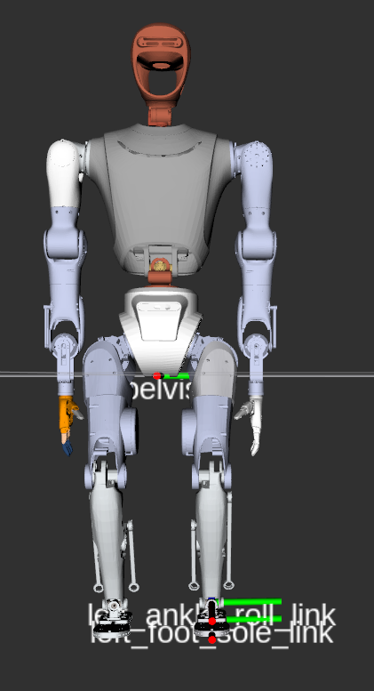
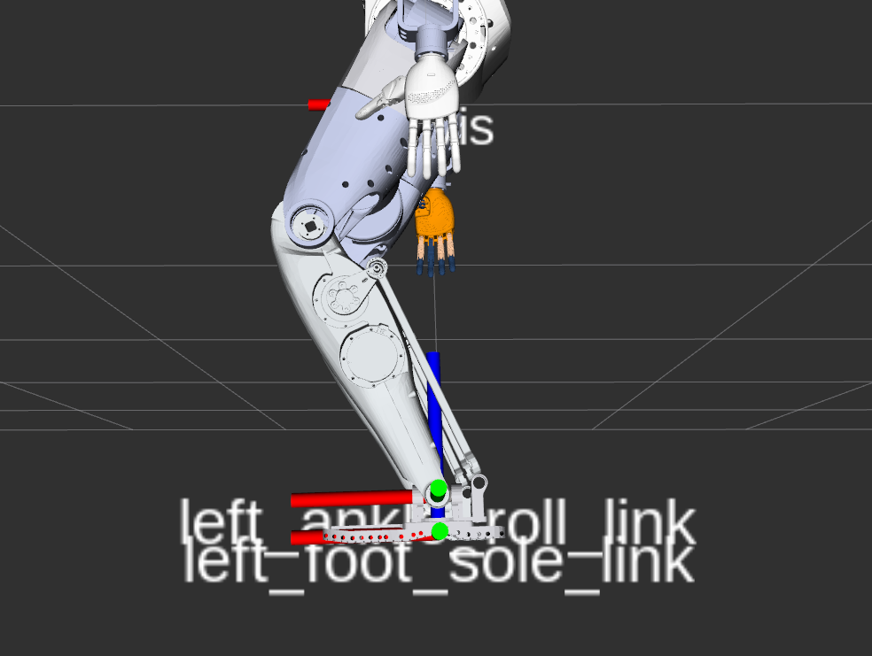
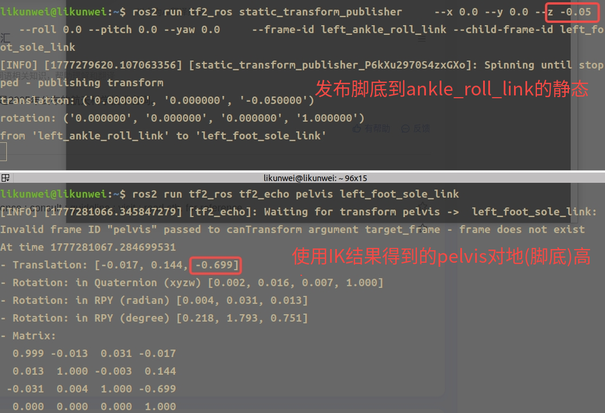

# 腿部逆运动学 (Leg IK) - 使用说明与环境安装

## 目录

- [1. 改动总结](#1-改动总结)
- [2. 使用说明](#2-使用说明)
- [3. 从零安装环境教程](#3-从零安装环境教程)
- [4. 常见问题](#4-常见问题)

---

## 1. 改动总结

### 1.1 新增文件

| 文件 | 路径 | 说明 |
|------|------|------|
| `leg_ik_py.py` | `ik_7dof/scripts/leg_ik_py.py` | 纯Python腿部6-DOF逆运动学求解器，使用MuJoCo进行FK和Jacobian计算 |
| `leg_ik_mujoco_verify.py` | `ik_7dof/scripts/leg_ik_mujoco_verify.py` | 腿部IK MuJoCo验证脚本 |


### 1.5 核心设计决策

| 决策 | 原因 |
|------|------|
| 不调用mj_step | 避免物理仿真导致机器人倾倒，保持纯刚性位置控制 |
| FOOT_SOLE_OFFSET_Z = 0.05m | 脚踝关节到脚底的实际距离，确保IK目标包含脚底偏移 |
| 多orient_weight策略（0.4/0.1/0.01） | 在关节限位约束下，降低朝向权重优先保证位置精度 |

---

## 2. 使用说明

### 2.1 快速开始

```bash
cd ~/humanoid_ws/src/ik_7dof/scripts

# 基本用法：指定骨盆高度，返回双腿关节角度
python3 leg_ik_mujoco_verify.py --pelvis_height 0.65

# 无头模式（仅验证，不启动MuJoCo）
python3 leg_ik_mujoco_verify.py --pelvis_height 0.65 --headless

# 不同骨盆高度
python3 leg_ik_mujoco_verify.py --pelvis_height 0.5 --headless
python3 leg_ik_mujoco_verify.py --pelvis_height 0.8 --headless
```

### 2.2 命令行参数

| 参数 | 类型 | 默认值 | 说明 |
|------|------|--------|------|
| `--pelvis_height` | float | 0.65 | 骨盆到地面的高度（米） |
| `--foot_offset_z` | float | 0.0 | 脚底到踝关节的额外z偏移（米），一般不需要修改 |
| `--left_q` | str | None | 手动指定左腿关节角度（6个逗号分隔值） |
| `--right_q` | str | None | 手动指定右腿关节角度（6个逗号分隔值） |
| `--headless` | flag | False | 无头模式，仅输出验证结果不启动查看器 |

### 2.3 输出说明

脚本运行后会输出以下信息：

```
调用Python IK求解器 (骨盆高度=0.65m)...
Python IK结果: 左腿=['-0.927382', '-0.154896', '-0.304237', '1.642432', '-0.751418', '0.008997']
Python IK结果: 右腿=['-0.927382', '0.154896', '0.304237', '1.642432', '-0.751418', '-0.008997']
调整骨盆高度: 0.650m -> 0.655m (脚底最低点: -0.004m)

===== MuJoCo FK验证 =====
骨盆位置: (0.0000, 0.0000, 0.6553)
左脚位置: (0.0000, 0.1400, 0.1753)
  左脚底z: 0.0053 m (目标: 0.0000 m)
  骨盆->左脚踝距离: 0.4800 m
  左脚朝向误差: 0.02 deg
右脚位置: (0.0000, -0.1400, 0.1753)
  右脚底z: 0.0053 m (目标: 0.0000 m)
  骨盆->右脚踝距离: 0.4800 m
  右脚朝向误差: 0.02 deg

===== 关节角度 =====
  left_hip_pitch_joint: -0.927382 rad
  left_hip_roll_joint: -0.154896 rad
  left_hip_yaw_joint: -0.304237 rad
  left_knee_joint: 1.642432 rad
  left_ankle_pitch_joint: -0.751418 rad
  left_ankle_roll_joint: 0.008997 rad
  right_hip_pitch_joint: -0.927382 rad
  right_hip_roll_joint: 0.154896 rad
  right_hip_yaw_joint: 0.304237 rad
  right_knee_joint: 1.642432 rad
  right_ankle_pitch_joint: -0.751418 rad
  right_ankle_roll_joint: -0.008997 rad
```

**关键指标解读：**

- **脚底z值**：应接近0.0m，表示脚底刚好在地面上（负值=穿膜，正值=悬空）
- **朝向误差**：应小于5度，表示脚掌基本水平
- **骨盆高度调整**：脚本会自动微调骨盆高度以避免穿膜

### 2.4 Python API 使用

```python
import mujoco
import numpy as np
from leg_ik_py import solve_leg_ik, solve_both_legs_ik, LEFT_LEG_JOINTS, RIGHT_LEG_JOINTS

# 加载MuJoCo模型
model = mujoco.MjModel.from_xml_path("path/to/fa_robot_combined_body_collision_modified.xml")
data = mujoco.MjData(model)

# 求解双腿IK
left_q, right_q = solve_both_legs_ik(model, data, pelvis_height=0.65)

# 单独求解左腿IK
left_q = solve_leg_ik(model, data, pelvis_height=0.65, side="left")

# 单独求解右腿IK
right_q = solve_leg_ik(model, data, pelvis_height=0.65, side="right")

# 自定义参数
left_q = solve_leg_ik(
    model, data,
    pelvis_height=0.7,
    side="left",
    foot_offset_z=0.0,      # 额外的脚底z偏移
    max_iters=200,           # 最大迭代次数
    eps=1e-3                 # 收敛阈值
)
```

### 2.5 腿部关节顺序

| 索引 | 左腿关节 | 右腿关节 | 范围 (rad) |
|------|----------|----------|------------|
| 0 | left_hip_pitch_joint | right_hip_pitch_joint | -2.09 ~ 2.09 |
| 1 | left_hip_roll_joint | right_hip_roll_joint | -0.52 ~ 2.62 / -2.62 ~ 0.52 |
| 2 | left_hip_yaw_joint | right_hip_yaw_joint | -0.79 ~ 0.79 |
| 3 | left_knee_joint | right_knee_joint | -0.05 ~ 2.09 / 0.05 ~ 2.09 |
| 4 | left_ankle_pitch_joint | right_ankle_pitch_joint | -1.05 ~ 0.52 |
| 5 | left_ankle_roll_joint | right_ankle_roll_joint | -0.35 ~ 0.35 |

### 2.6 IK算法说明

求解器采用与C++ `fa_ik_solver`一致的两阶段数值迭代算法：

**阶段1：LDLT快速求解**
- 使用阻尼最小二乘法 `dq = J^T * (J*J^T + λ²*I)^{-1} * err`
- 尝试3种朝向权重（0.4, 0.1, 0.01），在关节限位约束下优先保证位置精度
- 包含关节限位排斥力和舒适位姿回拉梯度
- 自适应步长：误差大时0.5，误差小时0.8，精调阶段1.0

**阶段2：SVD随机重启**
- 使用SVD伪逆 + 零空间投影
- 最多10次随机重启，每次膝盖强制弯曲0.2~1.5 rad
- 记录最优解，即使未达到eps阈值也返回最佳近似解（误差<0.15时）

### 2.7 适用骨盆高度范围

| 高度 | IK结果 | 说明 |
|------|--------|------|
| 0.40m | 可能失败 | 超出腿部运动范围 |
| 0.50m | 近似解 | 膝盖达极限，朝向误差约3-5度 |
| 0.55m ~ 0.85m | 精确解 | 朝向误差<0.1度 |
| 0.90m+ | 可能失败 | 接近腿完全伸直，关节奇异 |

---

## 3. 从零安装环境教程

### 3.1 系统要求

| 项目 | 要求 |
|------|------|
| 操作系统 | Ubuntu 22.04 LTS |
| Python | 3.10+ |
| Conda | Miniconda3 或 Anaconda3 |
| 磁盘空间 | > 5GB |

### 3.2 安装 Miniconda

```bash
# 下载 Miniconda 安装脚本
wget https://repo.anaconda.com/miniconda/Miniconda3-latest-Linux-x86_64.sh

# 运行安装
bash Miniconda3-latest-Linux-x86_64.sh

# 按提示操作：
# - 阅读协议，输入 yes
# - 确认安装路径（默认 ~/miniconda3）
# - 选择是否初始化 conda (yes)

# 重新加载 shell
source ~/.bashrc

# 验证安装
conda --version
```

### 3.3 创建 Python 环境

```bash
# 创建新的 conda 环境
conda create -n leg_ik python=3.10 -y

# 激活环境
conda activate leg_ik
```

### 3.4 安装 Python 依赖

```bash
# 安装 MuJoCo（核心依赖，包含FK和Jacobian计算）
pip install mujoco

# 安装 NumPy
pip install numpy

# 验证安装
python3 -c "import mujoco; print('MuJoCo:', mujoco.__version__)"
python3 -c "import numpy; print('NumPy:', numpy.__version__)"
```

**依赖版本参考：**

| 包 | 最低版本 | 推荐版本 |
|----|----------|----------|
| mujoco | >= 3.0.0 | 3.8.0 |
| numpy | >= 1.24.0 | 2.x |

### 3.5 获取项目代码

```bash
# 创建工作空间
mkdir -p ~/humanoid_ws/src
cd ~/humanoid_ws/src

# 克隆项目（替换为实际仓库地址）
git clone <repository_url> .

# 确认关键文件存在
ls ik_7dof/scripts/leg_ik_py.py
ls ik_7dof/scripts/leg_ik_mujoco_verify.py
ls sysmo_description/mjcf/fa_robot_combined_body_collision_modified.xml
```

### 3.6 运行验证

```bash
cd ~/humanoid_ws/src/ik_7dof/scripts

# 运行基本验证
python3 leg_ik_mujoco_verify.py --pelvis_height 0.65 --headless

# 启动交互式查看器
python3 leg_ik_mujoco_verify.py --pelvis_height 0.65
```

## 4. 常见问题

### Q1: IK求解失败怎么办？

**可能原因：**
- 骨盆高度超出腿部运动范围（建议0.5m~0.85m）
- 初始猜测不佳

**解决方案：**
```python
# 增加迭代次数
left_q = solve_leg_ik(model, data, pelvis_height=0.55, max_iters=500)

# 放宽收敛阈值
left_q = solve_leg_ik(model, data, pelvis_height=0.55, eps=0.05)

# 提供初始猜测
initial_q = np.array([-1.0, -0.2, -0.3, 1.5, -0.7, 0.0])
left_q = solve_leg_ik(model, data, pelvis_height=0.55, initial_q=initial_q)
```

### Q2: 脚掌穿膜（嵌入地面）怎么办？

脚本会自动检测脚底最低点并调整骨盆高度。如果仍然穿膜：

```python
# 增加脚底偏移
left_q, right_q = solve_both_legs_ik(model, data, pelvis_height=0.65, foot_offset_z=0.02)
```

### Q3: 机器人倾倒怎么办？

当前设计不调用`mj_step`（物理仿真步进），机器人保持纯刚性位置控制，不会倾倒。如果需要物理仿真，需要增加脚底碰撞盒并调整摩擦参数。

### Q4: 如何在代码中集成腿部IK？

```python
import mujoco
import numpy as np
import sys
sys.path.insert(0, "/path/to/ik_7dof/scripts")
from leg_ik_py import solve_both_legs_ik

model = mujoco.MjModel.from_xml_path("path/to/fa_robot_combined_body_collision_modified.xml")
data = mujoco.MjData(model)

# 输入骨盆高度，获取关节角度
left_q, right_q = solve_both_legs_ik(model, data, pelvis_height=0.65)

if left_q is not None and right_q is not None:
    print(f"左腿关节角度: {left_q}")
    print(f"右腿关节角度: {right_q}")
else:
    print("IK求解失败")
```

### Q5: MuJoCo模型文件路径如何配置？

脚本会在以下路径按顺序搜索模型文件：
1. `ik_7dof/scripts/../sysmo_description/mjcf/fa_robot_combined_body_collision_modified.xml`
2. `ik_7dof/scripts/../../src/sysmo_description/mjcf/fa_robot_combined_body_collision_modified.xml`
3. `~/humanoid_ws/src/sysmo_description/mjcf/fa_robot_combined_body_collision_modified.xml`

也可以直接修改脚本中的 `MUJOCO_MODEL_PATH` 变量。

## 5. 自测结果
使用脚本按指定骨盆高度求解双腿IK，并用MuJoCo做FK验证。

运行命令：

```bash
cd ~/humanoid_ws/src/ik_7dof/scripts
python3 leg_ik_mujoco_verify.py --pelvis_height 0.7
```

示例输出：

```text
MuJoCo模型: /home/likunwei/humanoid_ws/src/sysmo_description/mjcf/fa_robot_combined_body_collision_modified.xml

调用Python IK求解器 (骨盆高度=0.7m)...
Python IK结果: 左腿=['-0.518388', '-0.049313', '-0.189725', '0.908782', '-0.423067', '0.002262']
Python IK结果: 右腿=['-0.518388', '0.049313', '0.189725', '0.908782', '-0.423067', '-0.002262']
调整骨盆高度: 0.700m -> 0.825m (脚底最低点: -0.124m)

===== MuJoCo FK验证 =====
骨盆位置: (0.0000, 0.0000, 0.8253)
左脚位置: (0.0000, 0.1400, 0.1753)
  左脚底z: 0.1253 m (目标: 0.0000 m)
  骨盆->左脚踝距离: 0.6500 m
  左脚朝向误差: 0.02 deg
右脚位置: (0.0000, -0.1400, 0.1753)
  右脚底z: 0.1253 m (目标: 0.0000 m)
  骨盆->右脚踝距离: 0.6500 m
  右脚朝向误差: 0.02 deg

===== 关节角度 =====
  left_hip_pitch_joint: -0.518388 rad  (-29.701 deg)
  left_hip_roll_joint: -0.049313 rad  (-2.825 deg)
  left_hip_yaw_joint: -0.189725 rad  (-10.870 deg)
  left_knee_joint: 0.908782 rad  (52.069 deg)
  left_ankle_pitch_joint: -0.423067 rad  (-24.240 deg)
  left_ankle_roll_joint: 0.002262 rad  (0.130 deg)
  right_hip_pitch_joint: -0.518388 rad  (-29.701 deg)
  right_hip_roll_joint: 0.049313 rad  (2.825 deg)
  right_hip_yaw_joint: 0.189725 rad  (10.870 deg)
  right_knee_joint: 0.908782 rad  (52.069 deg)
  right_ankle_pitch_joint: -0.423067 rad  (-24.240 deg)
  right_ankle_roll_joint: -0.002262 rad  (-0.130 deg)
```

结果截图：

<table>
  <tr>
    <td align="center"></td>
    <td align="center"></td>
    <td align="center"></td>
  </tr>
</table>
